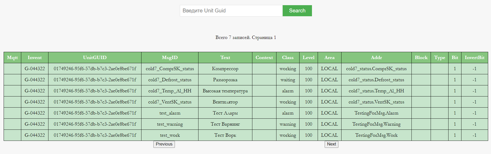

## Запуск проекта

Для запуска необходимо иметь Docker.  

Предоставляется возможность выбрать базу данных для работы: MongoDB или Clickhouse.


В командной строке указываем переменную окружения DB_TYPE
```
$env:DB_TYPE = "mongodb"
$env:DB_TYPE = "clickhouse"
```

В корне проекта создаем файлы .env (mongodb_credentials.env, clickhouse_credentials.env) с реквизитами для входа для БД

```
MONGO_USERNAME=test
MONGO_PASSWORD=test


CLICKHOUSE_USERNAME=test
CLICKHOUSE_PASSWORD=test
```

Запускаем скрипт

```
.\start.sh 
```

Проверяем, что контейнер с БД запущен
```
docker ps
```
```
CONTAINER ID   IMAGE          COMMAND                  CREATED          STATUS          PORTS                      NAMES
d77bd9151959   mongo:latest   "docker-entrypoint.s…"   18 seconds ago   Up 16 seconds   0.0.0.0:27017->27017/tcp   mongo-demo-v

```

```
CONTAINER ID   IMAGE                      COMMAND            CREATED         STATUS         PORTS                                                      NAMES
56eb0e9bd56f   yandex/clickhouse-server   "/entrypoint.sh"   3 seconds ago   Up 2 seconds   0.0.0.0:8123->8123/tcp, 0.0.0.0:9000->9000/tcp, 9009/tcp   clickhouse-demo-v

```

В файле ```db.yml``` выбираем имплементацию БД

```
db_impl: "mongodb"
db_impl: "clickhouse"
```

В MongoDB не существующие ранее коллекции создадутся автоматически.
Для Clickhouse необходимо самостоятельно создать таблицы ```file``` и ```guid```.
Скрипты .sql находятся в ```db/scripts/clickhouse```.


Собираем проект

```
go build
```

Запускаем проект
```
./biocad_internship.exe
```

Отчеты в формате pdf будут помещены в директорию ```test_working_dirs/output_pdf_files```

Реализован API интерфейс. По ```http://localhost:8080/index``` и ```http://localhost:8080/json```  принимаются запросы для предоставления данных из бд.





JSON response ```http://localhost:8080/json?id=01749246-9617-585e-9e19-157ccad61ee2&page=1```

```
{
"Title":"01749246-9617-585e-9e19-157ccad61ee2",
"Message":[
{"mqtt":"","invent":"G-044325","unit_guid":"01749246-9617-585e-9e19-157ccad61ee2","msg_id":"cold78_ComprSK_status","text":"Компрессор","context":"","class":"working","level":100,"area":"LOCAL","addr":"cold78_status.ComprSK_status","block":"","type":"","bit":1,"invert_bit":-1},
{"mqtt":"","invent":"G-044325","unit_guid":"01749246-9617-585e-9e19-157ccad61ee2","msg_id":"cold78_Defrost_status","text":"Разморозка","context":"","class":"waiting","level":100,"area":"LOCAL","addr":"cold78_status.Defrost_status","block":"","type":"","bit":1,"invert_bit":-1},
{"mqtt":"","invent":"G-044325","unit_guid":"01749246-9617-585e-9e19-157ccad61ee2","msg_id":"cold78_Temp_Al_HH","text":"Высокая температура","context":"","class":"alarm","level":100,"area":"LOCAL","addr":"cold78_status.Temp_Al_HH","block":"","type":"","bit":1,"invert_bit":-1},
{"mqtt":"","invent":"G-044325","unit_guid":"01749246-9617-585e-9e19-157ccad61ee2","msg_id":"cold78_VentSK_status","text":"Вентилятор","context":"","class":"working","level":100,"area":"LOCAL","addr":"cold78_status.VentSK_status","block":"","type":"","bit":1,"invert_bit":-1}],
"Total":4,
"PageN":1,
"UnitGuid":"01749246-9617-585e-9e19-157ccad61ee2",
"PageSize":15}
```
